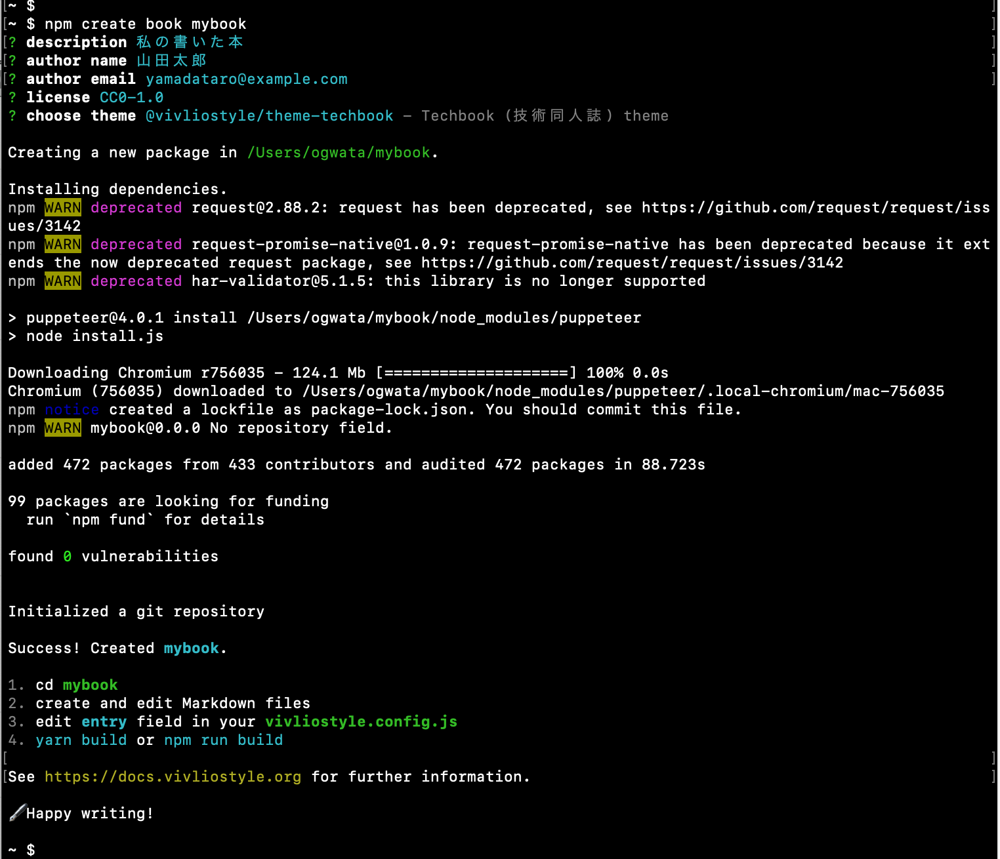
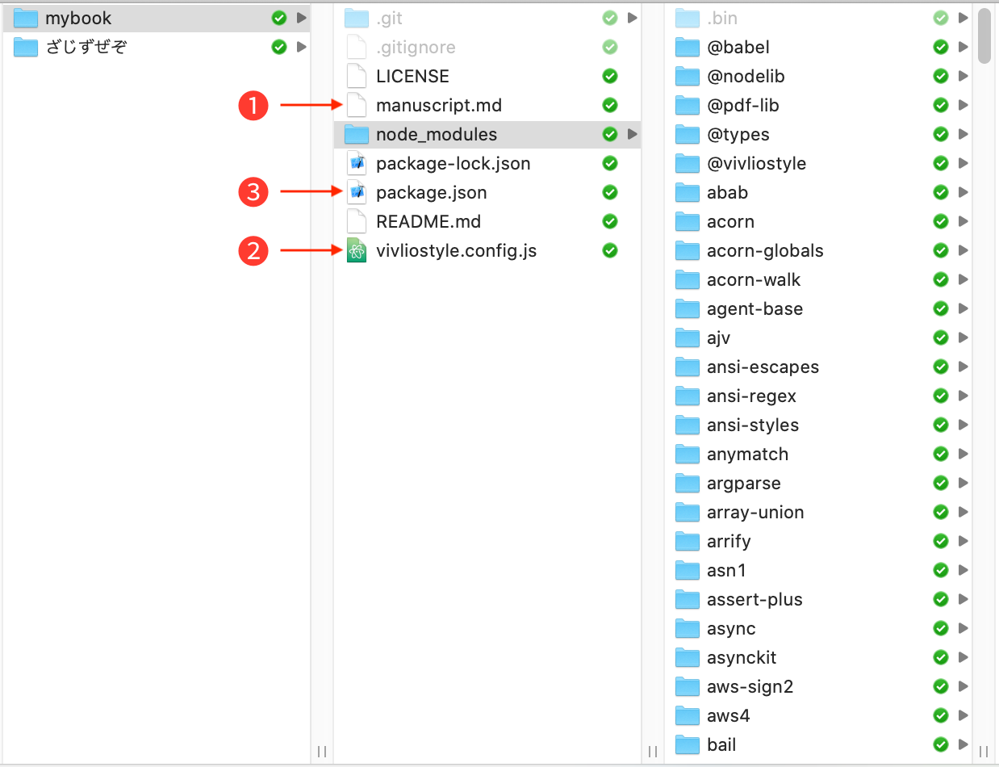
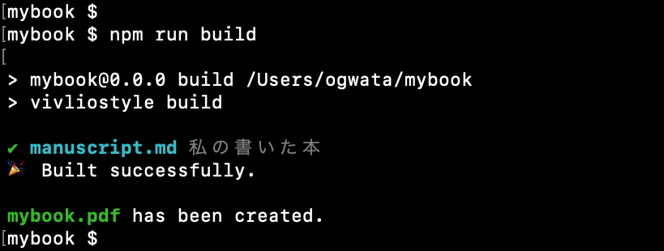
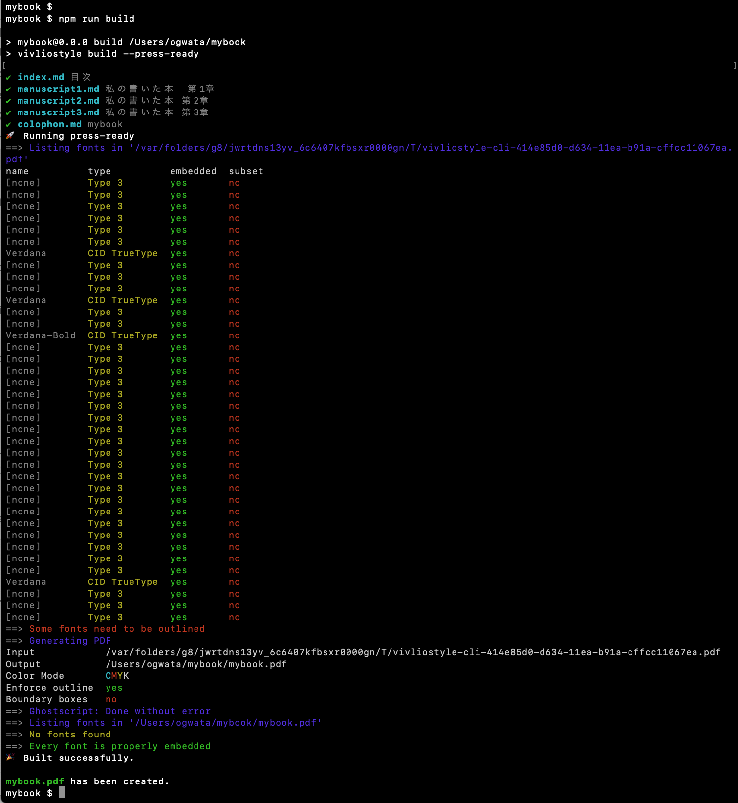

# Create Book

## はじめに

[Create Book](https://github.com/vivliostyle/create-book) は、簡単に本を作れる環境を構築します。テンプレートをつかって原稿を執筆し、各種のカスタマイズをした後、[Vivliostyle CLI](https://github.com/vivliostyle/vivliostyle-cli) により本を生成します。専門的な HTML や CSS の知識は必要ありません。

本文書では、複数のページを綴じた PDFファイルを一括して「本」と呼びます。 [Vivliostyle](https://github.com/vivliostyle) はさまざまな形の本を作るためのライブラリです。より多くのユーザに、より簡単に Vivliostyle の技術を届けるプロダクトが Create Book です。

## 本文書が対象とするバージョン

- v0.1.x

## 本文書の読者対象

- ターミナルの操作がある程度できる
- markdownの記法をある程度知っている
- 以下のような本を手間をかけずに作りたいと思っている
    - 技術同人誌をふくむ横書き文書
    - 学術論文をふくむ横書き文書
    - 小説同人誌をふくむ縦書き文書
    - スライド

## Create Bookの動作環境

- macOS 10.13 (High Sierra) 以上
- Windows 10
- 以下がインストールずみであること
    - [Node.js](https://nodejs.org/ja/) (v12 以上)
- 印刷用PDFファイルの出力には、以下のインストールも必要
    - [ghostscript](https://www.ghostscript.com/)
    - [Xpdf](https://texwiki.texjp.org/?Xpdf)

## 本を作る手順

以下の手順により本を作成することができます。

1. [Create Book](https://github.com/vivliostyle/create-book) を実行し、プロジェクトフォルダを作成
2. 作成されたプロジェクトフォルダに移動
3. 既存の markdown ファイルを編集して原稿を執筆
4. `vivliostyle.config.js` を編集してカスタマイズ
5. npm により [Vivliostyle CLI](https://github.com/vivliostyle/vivliostyle-cli) を実行し本を生成

作成されるプロジェクトフォルダは git で管理されるため、[SourceTree](https://www.sourcetreeapp.com/ )
などの git クライアントを使えば、現在の版と以前の版を比較したり戻したりといった、バージョン管理による本作りができます (もしバージョン管理が不要でしたら、無視しても全く問題ありません)。なお、本文書では git の解説はしません。各種解説書、解説サイトをご参照ください。

## インストール

プロジェクトフォルダを作成するインストールコマンドは下記の通りです。`<directory>` には作成しようとする本のプロジェクトフォルダ名を指定します。非ASCII文字は使えません。

```
npm create book <directory>
```

指定したプロジェクトフォルダが既に存在しており、且つそのフォルダが空でない場合、 Create Book はエラーになります（既存のフォルダが空であればインストールは成功します）。

なお、[npm](https://www.npmjs.com/ )以外に [yarn](https://classic.yarnpkg.com/ja/ )も利用可能ですが、本文書ではより一般的な前者で説明します。

インストールの際、以下の項目を指定することができます (図1)。必ずしもここで全てを指定する必要はなく、指定したくない場合はリターンキーで次の項目に移動できます。後述の `vivliostyle.config.js` を編集することで変更が可能です。

<figure>


<figcaption>図1 Create Bookのインストール。プロジェクトフォルダ名として mybook を指定している。なお、npmから警告が出るがユーザに影響はない。</figcaption>
</figure>

- description (本の内容に関する簡単な説明。英数字以外に漢字片仮名平仮名も使用可)
- author name (著者名。英数字以外に漢字片仮名平仮名も使用可)
- author email (著者のメールアドレス)
- license (配布ライセンスの種別を矢印キー上下で選択)
- choose theme (下記テーマパッケージを矢印キー上下で選択)
    - `@vivliostyle/theme-bunko`……小説同人誌をふくむ縦書き文書／冊子
    - `@vivliostyle/theme-techbook`……技術同人誌をふくむ横書き冊子
    - `@vivliostyle/theme-slide`……スライド
    - `@vivliostyle/theme-academic`……論文、レポートをふくむ横書き文書

なお、[テーマパッケージ](https://github.com/vivliostyle/themes)もOSS開発です。開発が進むにつれ、上記以外にも追加される可能性があります。

## Create Book の仕組み

下図は実際にインストールしたプロジェクトフォルダ (ここでは `mybook`) の内容です (図2)。自分の意図に合わせて本を作るため、❶〜❸のファイルを編集します。

<figure>


<figcaption>図2 インストールにより生成されたmybookフォルダの内容。なお、グレイのファイル／フォルダは不可視属性。</figcaption>
</figure>

- ❶ `manuscript.md` ……本の原稿となる markdownファイル
- ❷ `vivliostyle.config.js` ……判型や目次／奥付の追加など本をカスタマイズする設定ファイル
- ❸ `package.json` ……プロジェクトフォルダ全体の設定ファイル

Create Book は JavaScript の実行環境の一つである [Node.js](https://nodejs.org/ja/ ) に付属するコマンドラインインターフェイス、[npm](https://www.npmjs.com/ )によって本作りをします。Create Book はインストールの際、以下のようなことをします。

- npm が参照する設定ファイル `vivliostyle.config.js` (❷)や `package.json`(❸)を作成
- 原稿のテンプレート `manuscript.md`(❶)を作成
- `node_modules` フォルダ (図2) に、npm が使用する各種ライブラリをインストール

npm は上記設定ファイルを参照し、また上記ライブラリを使いながら、Vivliostyle CLI を駆動して `manuscript.md` を組版し、PDFファイルに出力します。

## 原稿の執筆

インストールすると作成される `manuscript.md` (図2❶) をテンプレートにして原稿を執筆します。記法は標準的な markdown である[GFM (GitHub Flavored Markdown)](https://github.github.com/gfm/ )を、書籍向けに拡張した [VFM (Vivliostyle Flavored Markdown)](https://github.com/vivliostyle/vfm) です。

GFM の上位互換ですから、慣れた人なら基本的な記法は GFM がそのまま使え、新たに覚えるのは VFM だけですみます。

### GFM (GitHub Flavored Markdown)

下記の外部サイトを参照してください。

- [基本的な書き方とフォーマットの構文 /GitHub](https://docs.github.com/ja/github/writing-on-github/basic-writing-and-formatting-syntax) (ただし、記事中[「絵文字の利用」](https://docs.github.com/ja/github/writing-on-github/basic-writing-and-formatting-syntax#using-emoji)はCreate Bookでサポートされません)
-  [高度なフォーマットを使用して作業する /GitHub](https://docs.github.com/ja/github/writing-on-github/working-with-advanced-formatting)

### VFM (Vivliostyle Flavored Markdown)

詳細な仕様は下記を参照してください。

- [Vivliostyle Flavored Markdown: Working Draft](https://vivliostyle.github.io/vfm/#/vfm)

ただし、現バージョンでは以下の項目のみ実装しています。

- [Hard new line (強制改行)](https://vivliostyle.github.io/vfm/#/vfm#hard-new-line)
- [Code (コードの記述)](https://vivliostyle.github.io/vfm/#/vfm#code)
    - [with caption (コード部分のキャプション)](https://vivliostyle.github.io/vfm/#/vfm#with-caption)
- [Image (画像とそのサイズ指定)](https://vivliostyle.github.io/vfm/#/vfm#image)

  なお、仕様に書かれていませんが、以下の記法で画像のサイズ指定が可能です。画像ファイルは(  )内に相対パスで指定します。xxxは数値、単位はpxですが省略して記述します。`width` (幅) の他に `height` (高さ) も使えます。

    ```md
    {width=xxx}
    ```
    - [with caption (画像のキャプション)](https://vivliostyle.github.io/vfm/#/vfm#with-caption-2)
- [Ruby (ルビの記述)](https://vivliostyle.github.io/vfm/#/vfm#ruby)
- [Raw HTML (HTMLそのままの記述)](https://vivliostyle.github.io/vfm/#/vfm#raw-html)
- [Frontmatter (書名の指定)](https://vivliostyle.github.io/vfm/#/vfm#frontmatter)


### その他の記法

#### 注

GFM にも VFM にも規定されていませんが、下記外部サイトの記法でいくつかの 後注が利用できます。

- [remark-footnotes](https://www.npmjs.com/package/remark-footnotes)

また、テーマパッケージ `@vivliostyle/theme-techbook` を選択した場合、より煩雑にはなりますが、以下の記法で脚注が利用できます。

```md
 <span class="footnote">text</span>
```


#### 縦中横

テーマパッケージ `@vivliostyle/theme-bunko`を選択すると、以下の記法で縦中横が書けるようになります。テーマパッケージの選択については、後述[テーマパッケージの指定](#テーマパッケージの指定)を参照してください。

```md
ええと<span class="tcy">4</span>×<span class="tcy">5</span>＝<span class="tcy">12</span>、<span class="tcy">4</span>×<span class="tcy">6</span>＝<span class="tcy">13</span>、<span class="tcy">4</span>×<span class="tcy">7</span>——ああ、もう！　そんな調子じゃいつまでも<span class="tcy">20</span>にならなくてよ！
```

## 本のカスタマイズ

`vivliostyle.config.js` (図2❷) を編集することで、次のようなカスタマイズが可能になります。

### 書名の指定

以下のように `title` を指定すると書名となります (値をシングルクォートで括る。以下同じ)。

```js
title: 'mybook',
```

### 著者名とメールアドレスの指定

インストール時に `author name`  で入力した著者名がデフォルトになりますが、以下のように指定すると、それが優先されます。

```js
author: 'yamada <yamadataro@example.com>',
```

### 使用する言語の指定

`language` のコメントアウト (スラッシュ部分) を削除すると、本で使用する言語を指定できます。デフォルトの英語は  `en`、日本語は `ja`。その他、 [ISO 639-1](https://www.loc.gov/standards/iso639-2/php/code_list.php )に規定された2文字コードが指定できます。

```js
// language: 'ja',
```
↓
```js
language: 'ja',
```

### 判型の指定

`size`のコメントアウトを削除すると判型を指定できます。[CSS Paged Media Module Level 3 (7.1. Page size)](https://drafts.csswg.org/css-page-3/#page-size-prop )に規定された下記の値が指定できます。なお、日本での一般的なB5は `JIS-B5` ですのでご注意ください (B4も同様)。

- `A5`
- `A4` (デフォルト)
- `A3`
- `B5`
- `B4`
- `JIS-B5`
- `JIS-B4`
- `letter`
- `legal`
- `ledger`

```js
// size: 'A4',
```
↓
```js
size: 'JIS-B5',
```

### テーマパッケージの指定

インストール時に `theme` で指定したテーマパッケージがデフォルトで読み込まれますが、ここで任意のテーマパッケージを指定すると、そちらが優先されます。

```js
theme: 'sample.css',
```

テーマパッケージは本のスタイルを定義したCSSファイルを含みます。仕様は下記を参照してください。

- [Theme の仕様](https://vivliostyle.github.io/themes/#/ja/spec)

なお、テーマパッケージは下記から取得できます。

- [npm: keywords / vivliostyle-theme](https://www.npmjs.com/search?q=keywords:vivliostyle-theme)


### 複数原稿の掲載

`entry` の部分で下記のように指定することで、複数の markdown ファイルをまとめて1冊にできます。

```js
entry: [
    "filename1.md",
    "filename2.md",
    "filename3.md",
],
```

### 目次の追加

以下の手順で目次を追加することができます。

1. あらかじめ以下のような目次用の markdown ファイルを用意し、ファイル名を `index.md` としてプロジェクトフォルダに保存します。なお、HTMLのタグがある行とmarkdownの行の間には、必ず空行をいれるよう注意してください。そうしないとエラーになります。

```md
# 本のタイトル

<nav id="toc" role="doc-toc">

## 目次

- [記事タイトル1](filename1.html)
- [記事タイトル2](filename2.html)
- [記事タイトル3](filename3.html)

</nav>
```

2. `vivliostyle.config.js` の `entry` の先頭行に、用意した `index.md` を指定します。

```js
entry: [
    "index.md",
    "filename1.md",
    "filename2.md",
    "filename3.md",
],
```

### 奥付の追加

以下の手順で奥付を追加することができます。

1. あらかじめ以下のような markdownファイルを用意し、ファイル名を `colophon.md` としてプロジェクトフォルダに保存します。なお、HTMLのタグがある行とmarkdownの行の間には、必ず空行をいれるよう注意してください。そうしないとエラーになります。

```md
<section id="colophon" role="doc-colophon">

## 私が書いた本
20xx年x月x日　初版発行
- 発行　私が書いた本刊行会
- 編集　山田太郎
- 印刷　Sample Printing
© My Book Publishing, 20xx

</section>
```

2. `vivliostyle.config.js` の `entry` の末尾行に、用意した `colophon.md` を指定します。

```js
entry: [
    "index.md",
    "filename1.md",
    "filename2.md",
    "filename3.md",
    "colophon.md",
],
```

### 本の生成

npm スクリプトにより、Vivliostyle CLI を使って本を生成します。以下のコマンドを実行すると、プロジェクトフォルダと同名のPDFファイルを出力します。

なお、つづけて同じコマンドを実行すると、前回生成したPDFファイルは警告なく上書きされます。保存したい場合はあらかじめ別の場所に待避するようご注意ください。

```
npm run build
```

<figure>


<figcaption>図3 Vivliostyle CLI を使った本の生成。</figcaption>
</figure>

### 4色印刷用PDFファイル の生成

`package.json` (図2❸) を編集して、下記のように `"vivliostyle build"` の部分に `--press-ready` オプションを追加することで、PDF/X-1a規格に適合した4色印刷可能なPDFファイルを生成することができます。

```js
"build": "vivliostyle build",
```
↓
```js
"build": "vivliostyle build --press-ready",
```

なお、このオプションを指定した際、データにドロップシャドウなど透明画像が含まれている場合に限って全体がラスタライズ（ビットマップ化）され、その結果文字の縁などにわずかな滲みが出ます。大きな問題にはなりませんが、不安な場合はあらかじめ印刷所にご相談ください。この現象は、[Acrobat Pro DC](https://acrobat.adobe.com/jp/ja/acrobat/acrobat-pro.html ) 等により、PDF/X-4 に変換することで回避できます。

以下は生成時のキャプチャです (図4)。

<figure>


<figcaption>図4 CMYK (4色) 印刷用のPDF/x-1aを出力。</figcaption>
</figure>

## 制限事項

現在のバージョンでは、以下のような制限があります。

- 任意のカバー画像を含めてPDFファイルに出力することがができません。その場合は、[Acrobat Pro DC](https://acrobat.adobe.com/jp/ja/acrobat/acrobat-pro.html ) や[プレビュー (mac)](https://support.apple.com/ja-jp/guide/preview/prvw11793/mac )などのPDFエディタをご利用ください。
- グレイスケールの印刷用PDFファイルが出力できません。この問題は、[Acrobat Pro DC](https://acrobat.adobe.com/jp/ja/acrobat/acrobat-pro.html )で変換することで回避できます。
- ディレクトリ名に非ASCII文字が含まれているとエラーになります。

## おわりに

バージョン番号をみてもお分かりのように、Create Book はまだ開発中。そして Vivliostyle のプロダクトはすべてオープンソース。こうなればいい、こんな機能はないの、こんなエラーが出たなどの感想や報告を、ぜひお寄せください。もちろん開発に加わりたい！　も大歓迎。詳しくは下記のページをご覧ください。

- [コミュニティ/Vivliostyle](https://vivliostyle.org/ja/community/)
